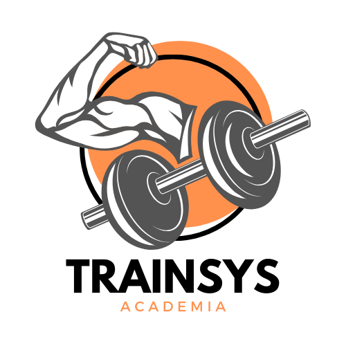

# Projeto TrainSys


<p align="center">
  
</p>

Uma inovadora aplicação web feita para proporcionar excelência no gerenciamento de treinos.
Dedicada aos instrutores de academia para aprimorar a administração dos treinamentos de seus alunos.
Esta API permite de forma intuitiva e dinâmica cadastrar, listar e gerenciar usuarios, estudantes, exercícios e treinos.

## Índice
- [Funcionalidades do Projeto](#funcionalidades)
- [Documentação da API](#layout)
- [Demostratração](#demostracao)
- [Como rodar este projeto?](#rodar)
- [Technologias Utilizadas](#technologias)
- [Autora](#autora)
- [Proximos passos](#passos)


<a name="funcionalidades"></a>
## Funcionalidades do Projeto

- [x] Login
- [x] Cadastro Usuario
- [x] Dashboard	
- [x] Gerenciamento de Exercicios
- [x] Gerenciamento do Alunos
- [x] Cadastro Novo Aluno
- [x] Cadastro Treino
- [x] Visualização Treinos

<a name="layout"></a>
## Documentação da API

### Endpoints - Rotas 

####  S01 - Cadastro Usuario


> `Layout do email`   
<p align="center">

</p>

> `HTTP POST /api/users`   

<p align="center">

</p>

  | Parâmetro | Tipo | Descrição |
| --- | --- |:--- |
| `id` | `int`| **Autoincremental** . Chave primaria
| `name` | `string`|**Obrigatório** . Nome do usúario |
| `email` | `string`|**Obrigatório** . Email do usúario, único |
| `date_birth` | `string`|**Obrigatório** . Data de aniversário  |
| `cpf` | `string`|**Obrigatório** . CPF do usúario, único e válido |
| `password` | `string`|**Obrigatório** . Senha do usúario |
| `plan_id` | `string`|**Obrigatório** . Chave estrangeira |

Request JSON exemplo

>{
  "name": "Carmen Oliveira",
  "email": "aoliveira@gmail.com",
  "date_birth": "1980-05-22",
  "cpf": "988.519.776-99",
  "password": "$2y$12$FsgW2zj2kUlEgDtrQGQg3eAoKFVuCm5ZJXXwcnXtN2cg62pbsLr5G",
  "plan_id": 1
}  

   | Response Status | Descrição| 
| --- | :--- |
| `201` | sucesso
| `400` | dados inválidos
</p>

####  S02 - Login

> `HTTP POST /api/login`    
<p align="center">

</p>


  | Parâmetro | Tipo | Descrição |
| --- | --- |:--- |
| `email` | `string`|**Obrigatório** . Email do usúario |
| `password` | `string`|**Obrigatório** . Senha do usúario |

Request JSON exemplo

>{  
  "token": "22|nB5FBfqzpRCraff4jCW8uwzyK6kSsW3u4ruEtCJfbb33f932",
  "name": "Carmen Oliveira"
}


   | Response Status | Descrição| 
| --- | :--- |
| `200` | sucesso
| `400` | dados inválidos
| `401` | login inválido
</p>


####  S03 - Dashboard	
> `HTTP POST /api/dashboard`    
<p align="center">

</p>


  | Parâmetro | Tipo | Descrição |
| --- | --- |:--- |
| `registered_students` | `int`|**Obrigatório** . Chave estrangeira de estudante. Quantidade de estudantes que usuário logado tem cadastrado |
| `registered_exercises` | `int`|**Obrigatório** . Chave estrangeira do exercícios. Quantidade de exercícios que usuário logado tem cadastrado  |
| `current_user_plan` | `int`|**Obrigatório** . Chave estrangeira do plano. Quantidade de cadastros de estudantes cadastrados no plano atual |
| `remaining_estudents` | `int`|**Obrigatório** . Quantidade de cadastros restantes de estudantes |

Request JSON exemplo

>{  
  "token": "22|nB5FBfqzpRCraff4jCW8uwzyK6kSsW3u4ruEtCJfbb33f932",
  "name": "Carmen Oliveira"
}
  

   | Response Status | Descrição| 
| --- | :--- |
| `200` | sucesso
</p>

####  S04 - Cadastro de Exercicios

> `HTTP POST /api/exercises`    
<p align="center">

</p>


  | Parâmetro | Tipo | Descrição |
| --- | --- |:--- |
| `id` | `int`|**Autoincremental.** Chave primaria |
| `description` | `string`|**Obrigatório** . Descripcao do exercício |
| `user_id` | `int`|**Obrigatório** . Chave estrangeira do usúario. Id do usuário que cadastrou o exercício |

Request JSON exemplo

>  {
  "description": "Supino reto",
  "user_id": 17,
  "id": 5
} 


   | Response Status | Descrição| 
| --- | :--- |
| `201` | sucesso
| `400` | dados inválidos
| `409` | conflict
</p>

####  S05 - Listagem de exercícios

> `HTTP GET /api/exercises`    
<p align="center">

</p>


>Não é necessario resquest body

Exemplo de resposta:
>  [
  {
    "id": 8,
    "description": "Abdominal solo"
  },
  {
    "id": 7,
    "description": "Agachamento"
  },
  {
    "id": 10,
    "description": "Mesa flexora"
  },
  {
    "id": 11,
    "description": "Panturrilha sentado"
  },
  {
    "id": 9,
    "description": "Rosca direta barra"
  },
  {
    "id": 5,
    "description": "Supino reto"
  },
  {
    "id": 6,
    "description": "Tríceps Máquina"
  }
]


   | Response Status | Descrição| 
| --- | :--- |
| `200` | sucesso
</p>

####  S06 - Deleção de exercícios

> `HTTP DELETE /api/exercices/:id` 
<p align="center">

</p>


>Não é necessario resquest body

Request exemplo: `/api/exercises/10`


   | Response Status | Descrição| 
| --- | :--- |
| `204` | sucesso
| `409` | conflict
| `403` | Forbidden
| `404` | Not found


### 2.2. Cores

<p align="center">

  | Elemento  | Cores |
| ------------- |:-------------:|
| Toolbar      | orange-accent-2     |
| Primary buttons   | orange-darken-2    |
| Secondary buttons   | orange-accent-1    |
| Icons| orange   |

</p>

 ### 2.3. Tipografia

 <p align="center">

| Elemento  | Tipografia |
| ------------- |:-------------:|
| Menu title     | text-h4     |
| Card title   | text-h4    |
| Table title    | text-h5    |
| Table body   | text-body-1   |
| Body  | text-body-1    |
| Text links | text-body-2    |

</p>

### 2.4. Matriz de funcionalidades do projeto

[Descargar matriz](../proyecto-m1/src/assets/Matriz%20funcionalidades%20App.pdf)


<a name="demostracao"></a>
## Demostratração

[Assista ao vídeo](https://youtu.be/ufBJTcmtrPU)

<a name="rodar"></a>
## Como rodar este projeto?
### APP
```bash
# Clone este repositório
$ git clone https://github.com/ElianaMT/ProjetoM1-sem13/tree/main

# Accese a pasta do projeto no seu terminal 
$ cd proyecto-m1

# Instale as dependencias
$ npm install

# Execute a aplicação
$ npm run dev

# A aplicação será iniciada na porta 5173, acesse pelo navegador:
http://localhost:5173/
```
### API
```bash
# Clone este repositório
$ git clone https://github.com/DEVinZucchetti/api_academia

# Instale as dependencias
$ npm install

# Execute a aplicação
$ npm run server

# A aplicação será iniciada na porta 3000, acesse pelo navegador:
http://localhost:3000/
```

<a name="technologias"></a>
## Technologias Utilizadas

1. HTML
2. CSS
3. [Vue.js](https://br.vuejs.org) 
4. [Vuetify](https://vuetifyjs.com/en/) 
5. JavaScript
6. [DatePicker](https://vue3datepicker.com/)

<a name="autora"></a>
## Autora


[Linkedin](https://www.linkedin.com/in/eliana-morillo-t-48888569/)
