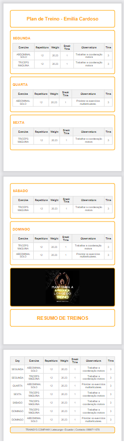

# Projeto TrainSys


<p align="center">
  
</p>

Uma inovadora aplicação web feita para proporcionar excelência no gerenciamento de treinos.
Dedicada aos instrutores de academia para aprimorar a administração dos treinamentos de seus alunos.
Esta API permite de forma intuitiva e dinâmica cadastrar, listar e gerenciar usuarios, estudantes, exercícios e treinos.

## Índice
- [Funcionalidades do Projeto](#funcionalidades)
- [Documentação da API](#layout)
- [Demostratração](#demostracao)
- [Técnicas e padrões utilizadas](#tecnicas)
- [Como rodar este projeto?](#rodar)
- [Technologias Utilizadas](#technologias)
- [Autora](#autora)
- [Proximos passos](#passos)


<a name="funcionalidades"></a>
## Funcionalidades do Projeto

- [x] S01 - Cadastro de usuário
- [x] S02 - Login
- [x] S03 -  Dashboard
- [x] S04 - Cadastro de exercícios
- [x] S05 - Listagem de exercícios
- [x] S06 - Deleção de exercícios
- [x] S07 - Cadastro de estudante
- [x] S08 - Listagem de estudantes
- [x] S09 - Deleção de estudante (Soft Delete)
- [x] S10 - Atualização de estudante 
- [x] S11- Cadastro de treinos
- [x] S12 - Listagem de treinos do estudante
- [x] S13 - Listagem de um estudante
- [x] S14 - Exportação de PDF

<a name="layout"></a>
## Documentação da API

### Endpoints - Rotas 

####  S01 - Cadastro Usuario

> `Layout do email`   
<p align="center">

</p>

> `HTTP POST /api/users`   

<p align="center">

</p>

  | Parâmetro | Tipo | Descrição |
| --- | --- |:--- |
| `id` | `int`| **Autoincremental** . Chave primaria
| `name` | `string`|**Obrigatório** . Nome do usúario |
| `email` | `string`|**Obrigatório** . Email do usúario, único |
| `date_birth` | `string`|**Obrigatório** . Data de aniversário  |
| `cpf` | `string`|**Obrigatório** . CPF do usúario, único e válido |
| `password` | `string`|**Obrigatório** . Senha do usúario |
| `plan_id` | `string`|**Obrigatório** . Chave estrangeira |

Request JSON exemplo
```http
{
  "name": "Carmen Oliveira",
  "email": "aoliveira@gmail.com",
  "date_birth": "1980-05-22",
  "cpf": "988.519.776-99",
  "password": "$2y$12$FsgW2zj2kUlEgDtrQGQg3eAoKFVuCm5ZJXXwcnXtN2cg62pbsLr5G",
  "plan_id": 1
}  
```

   | Response Status | Descrição| 
| --- | :--- |
| `201` | sucesso
| `400` | dados inválidos
</p>

####  S02 - Login

> `HTTP POST /api/login`    
<p align="center">

</p>


  | Parâmetro | Tipo | Descrição |
| --- | --- |:--- |
| `email` | `string`|**Obrigatório** . Email do usúario |
| `password` | `string`|**Obrigatório** . Senha do usúario |

Request JSON exemplo

```http
{  
  "token": "22|nB5FBfqzpRCraff4jCW8uwzyK6kSsW3u4ruEtCJfbb33f932",
  "name": "Carmen Oliveira"
}
```

   | Response Status | Descrição| 
| --- | :--- |
| `200` | sucesso
| `400` | dados inválidos
| `401` | login inválido
</p>


####  S03 - Dashboard	
> `HTTP POST /api/dashboard`    
<p align="center">

</p>


  | Parâmetro | Tipo | Descrição |
| --- | --- |:--- |
| `registered_students` | `int`|**Obrigatório** . Chave estrangeira de estudante. Quantidade de estudantes que usuário logado tem cadastrado |
| `registered_exercises` | `int`|**Obrigatório** . Chave estrangeira do exercícios. Quantidade de exercícios que usuário logado tem cadastrado  |
| `current_user_plan` | `int`|**Obrigatório** . Chave estrangeira do plano. Quantidade de cadastros de estudantes cadastrados no plano atual |
| `remaining_estudents` | `int`|**Obrigatório** . Quantidade de cadastros restantes de estudantes |

Request JSON exemplo
```http
{  
  "token": "22|nB5FBfqzpRCraff4jCW8uwzyK6kSsW3u4ruEtCJfbb33f932",
  "name": "Carmen Oliveira"
}
 ``` 

   | Response Status | Descrição| 
| --- | :--- |
| `200` | sucesso
</p>

####  S04 - Cadastro de Exercicios

> `HTTP POST /api/exercises`    
<p align="center">

</p>


  | Parâmetro | Tipo | Descrição |
| --- | --- |:--- |
| `id` | `int`|**Autoincremental.** Chave primaria |
| `description` | `string`|**Obrigatório** . Descrição do exercício |
| `user_id` | `int`|**Obrigatório** . Chave estrangeira do usúario. Id do usuário que cadastrou o exercício |

Request JSON exemplo
```http
{
  "description": "Supino reto",
  "user_id": 17,
  "id": 5
} 
```


   | Response Status | Descrição| 
| --- | :--- |
| `201` | sucesso
| `400` | dados inválidos
| `409` | conflict
</p>

####  S05 - Listagem de exercícios

> `HTTP GET /api/exercises`    
<p align="center">

</p>


>Não é necessario resquest body

Exemplo de resposta:
```http
[
  {
    "id": 8,
    "description": "Abdominal solo"
  },
  {
    "id": 7,
    "description": "Agachamento"
  },
  {
    "id": 10,
    "description": "Mesa flexora"
  },
  {
    "id": 11,
    "description": "Panturrilha sentado"
  },
  {
    "id": 9,
    "description": "Rosca direta barra"
  },
  {
    "id": 5,
    "description": "Supino reto"
  },
  {
    "id": 6,
    "description": "Tríceps Máquina"
  }
]
```

   | Response Status | Descrição| 
| --- | :--- |
| `200` | sucesso
</p>

####  S06 - Deleção de exercícios

> `HTTP DELETE /api/exercices/:id` 
<p align="center">

</p>


>Não é necessario resquest body

Request exemplo: `/api/exercises/10`


   | Response Status | Descrição| 
| --- | :--- |
| `204` | sucesso
| `409` | conflict
| `403` | forbidden
| `404` | not found

####  S07 - Cadastro de estudante


> `HTTP POST /api/students`   

<p align="center">

</p>

  | Parâmetro | Tipo | Descrição |
| --- | --- |:--- |
| `id` | `int`| **Autoincremental** . Chave primaria
| `name` | `string`|**Obrigatório** . Nome de estudante |
| `email` | `string`|**Obrigatório** . Email de estudante, único e válido |
| `date_birth` | `string`|**Obrigatório** . Data de aniversário  |
| `cpf` | `string`|**Obrigatório** . CPF de estudante, único e válido |
| `contact` | `string`|**Obrigatório** . Contato de estudante |
| `user_id` | `string`|**Obrigatório** . Chave estrangeira |
|  `city` | `string`|**Opcional** |
|  `neighborhood` | `string`|**Opcional** |
|  `number` | `string`|**Opcional** |
|  `street` | `string`|**Opcional** |
|  `state` | `string`|**Opcional** |
|  `cep` | `string`|**Opcional** |
|  `complement` | `string`|**Opcional** |


Request JSON exemplo

```http
{
  "name": "Emilia Cardoso",
  "email": "emicardo@gmail.com",
  "date_birth": "2000-01-24",
  "cpf": "339.556.779-11",
  "contact": "9876543412",
  "cep": "110987",
  "street": "Melchor de Benavides",
  "state": "SC",
  "neighborhood": "Kobrazol",
  "city": "Sao Joao",
  "complement": "Apartamento 10",
  "number": "113",
  "id": 9
}
```
</p>

>**Middleware** de verificação de limite de cadastro de estudante de acordo com o plano do usuário
<p align="center">


   | Response Status | Descrição| 
| --- | :--- |
| `201` | sucesso
| `400` | dados inválidos
| `403` | atingir o limite de cadastro do plano

</p>


####  S08 - Listagem de estudantes

> `HTTP GET /api/students` 
<p align="center">

</p>


>**Query params**
> - pesquisa geral - nome, cpf e email

Request exemplo: `/api/students`.Ordenado pelo nome do estudante.

```http
[
  {
    "id": 16,
    "name": "Daniel Navalny",
    "email": "daniel@gmail.com",
    "date_birth": "2003-05-24",
    "cpf": "999.111.779-11",
    "contact": "9896543412",
    "cep": "110987",
    "street": "Melchor de Benavides",
    "state": "SC",
    "neighborhood": "Kobrazol",
    "city": "Sao Joao",
    "complement": "Apartamento 10",
    "number": "113"
  },
  {
    "id": 17,
    "name": "Diego Soria",
    "email": "diego@gmail.com",
    "date_birth": "2003-05-24",
    "cpf": "999.111.179-11",
    "contact": "9896543412",
    "cep": "110987",
    "street": "Melchor de Benavides",
    "state": "SC",
    "neighborhood": "Kobrazol",
    "city": "Sao Joao",
    "complement": "Apartamento 10",
    "number": "113"
  },
  {
    "id": 9,
    "name": "Emilia Cardoso",
    "email": "emicardo@gmail.com",
    "date_birth": "2000-01-24",
    "cpf": "339.556.779-11",
    "contact": "9876543412",
    "cep": "110987",
    "street": "Melchor de Benavides",
    "state": "SC",
    "neighborhood": "Kobrazol",
    "city": "Sao Joao",
    "complement": "Apartamento 10",
    "number": "113"
  } 
]
```

   | Response Status | Descrição| 
| --- | :--- |
| `200` | sucesso

####  S09 - Deleção de estudante (Soft Delete)

> `HTTP DELETE /api/students/:id` 
<p align="center">

</p>


>Não é necessario resquest body

Request exemplo: `/api/students/14`


   | Response Status | Descrição| 
| --- | :--- |
| `204` | sucesso
| `403` | caso do id do estudante criado, não foi criado pelo usuário autenticado
| `404` | not found

####  S10 - Atualização de estudante 


> `HTTP PUT /api/students/:id`   

<p align="center">

</p>

  | Parâmetro | Tipo | Descrição |
| --- | --- |:--- |
| `name` | `string`|**Opcional** . Nome de estudante |
| `email` | `string`|**Opcional** . Email de estudante, único e válido |
| `date_birth` | `string`|**Opcional** . Data de aniversário  |
| `cpf` | `string`|**Opcional** . CPF de estudante, único e válido |
| `contact` | `string`|**Opcional** . Contato de estudante |
|  `city` | `string`|**Opcional** |
|  `neighborhood` | `string`|**Opcional** |
|  `number` | `string`|**Opcional** |
|  `street` | `string`|**Opcional** |
|  `state` | `string`|**Opcional** |
|  `cep` | `string`|**Opcional** |
|  `complement` | `string`|**Opcional** |


Request JSON exemplo
> `HTTP PUT /api/students/15`

```http
{
   "date_birth":"1987-06-28",
  "contact":"11 845698345"
}
```
</p>


   | Response Status | Descrição| 
| --- | :--- |
| `200` | sucesso

</p>

####  S11- Cadastro de treinos

> `HTTP POST /api/workouts`    
<p align="center">

</p>


  | Parâmetro | Tipo | Descrição |
| --- | --- |:--- |
| `id` | `int`|**Autoincremental.** Chave primaria |
| `student_id` | `int`|**Obrigatório** . Chave estrangeira de estudante|
| `exercise_id` | `int`|**Obrigatório** . Chave estrangeira do exercício|
| `repetitions` | `int`|**Obrigatório** |
| `weight` | `float`|**Obrigatório** |
| `break time` | `int`|**Obrigatório** |
| `day` | `string`|Valores: 'SEGUNDA','TERÇA', 'QUARTA', 'QUINTA', 'SEXTA', 'SÁBADO', 'DOMINGO'|
| `observations` | `text`|**Opcional** |
| `time` | `int`|**Obrigatório** |

Request JSON exemplo

```http
{
  "workout": {
    "student_id": 9,
    "exercise_id": 6,
    "repetitions": "12",
    "weight": 20.23,
    "break_time": 1,
    "day": "SÁBADO",
    "observations": "Trabalhar a coordenação motora",
    "time": "3",
    "user_id": 17,
    "id": 22
  }
}
``` 


   | Response Status | Descrição| 
| --- | :--- |
| `201` | sucesso
| `400` | dados inválidos
| `409` | conflict
</p>


####  S12 - Listagem de treinos do estudante

> `HTTP GET /api/students/:id/workouts` 
<p align="center">

</p>


Request exemplo: `/api/workouts?student_id=9`.Com a lista de treinos do estudante separado por dia da semana e ordenado pelo created_at do registro.

```http
{
  "student_id": 9,
  "student_name": "Emilia Cardoso",
  "workouts": {
    "QUARTA": [
      {
        "exercise_id": 7,
        "exercise_description": "Agachamento",
        "repetitions": 12,
        "weight": "20.23",
        "break_time": 1,
        "observations": "....................",
        "time": 3
      },
      {
        "exercise_id": 8,
        "exercise_description": "Abdominal solo",
        "repetitions": 12,
        "weight": "20.23",
        "break_time": 1,
        "observations": "Priorizar os exercícios multiarticulares.",
        "time": 3
      },
      {
        "exercise_id": 5,
        "exercise_description": "Supino reto",
        "repetitions": 12,
        "weight": "20.23",
        "break_time": 1,
        "observations": "....................",
        "time": 3
      },
      {
        "exercise_id": 6,
        "exercise_description": "Tríceps Máquina",
        "repetitions": 12,
        "weight": "20.23",
        "break_time": 1,
        "observations": "....................",
        "time": 3
      }
    ],
    "SEXTA": [
      {
        "exercise_id": 6,
        "exercise_description": "Tríceps Máquina",
        "repetitions": 12,
        "weight": "20.23",
        "break_time": 1,
        "observations": "Trabalhar a coordenação motora",
        "time": 3
      }
    ],
    "SÁBADO": [
      {
        "exercise_id": 6,
        "exercise_description": "Tríceps Máquina",
        "repetitions": 12,
        "weight": "20.23",
        "break_time": 1,
        "observations": "Trabalhar a coordenação motora",
        "time": 3
      }
    ],
    "DOMINGO": [
      {
        "exercise_id": 8,
        "exercise_description": "Abdominal solo",
        "repetitions": 12,
        "weight": "20.23",
        "break_time": 1,
        "observations": "Priorizar os exercícios multiarticulares.",
        "time": 3
      },
      {
        "exercise_id": 6,
        "exercise_description": "Tríceps Máquina",
        "repetitions": 12,
        "weight": "20.23",
        "break_time": 1,
        "observations": "Trabalhar a coordenação motora",
        "time": 3
      }
    ]
  }
}
```

   | Response Status | Descrição| 
| --- | :--- |
| `200` | sucesso

####  S13 - Listagem de um estudante

> `HTTP GET /api/students/:id` 
<p align="center">

</p>


Request exemplo: **/api/students/9**

```http
{
  "id": "9",
  "name": "Emilia Cardoso",
  "email": "emicardo@gmail.com",
  "date_birth": "2000-01-24",
  "cpf": "339.556.779-11",
  "address": {
    "cep": "110987",
    "street": "Melchor de Benavides",
    "province": "SC",
    "neighboarhood": null,
    "city": "Sao Joao",
    "complement": "Apartamento 10",
    "number": "113"
  }
}
```

   | Response Status | Descrição| 
| --- | :--- |
| `200` | sucesso

####  S14 - Exportação de PDF 

> `HTTP GET /api/students/export?id_do_estudante=:id` 
<p align="center">

</p>


Request exemplo: **/api/students/treino?id=9**


   | Response Status | Descrição| 
| --- | :--- |
| `200` | sucesso

<a name="demostracao"></a>
## Demostratração

[Assista ao vídeo](https://youtu.be/ufBJTcmtrPU)


<a name="tecnicas"></a>
## Técnicas e padrões utilizadas

O projeto foi dividido em uma estruturas de pastas para organizar os models, controllers, middlewares e database

<p align="center">

  | Local | Uso |
| ------------- |:-------------:|
| /src/models      | Contém todos modelos da aplicação    |
| /src/controllers   | Contém todos controllers da aplicação  |
| /src/middlewares   | Contém os middlewares de validação    |
| /src/database| Contém todas as migrations da aplicação  |

### Modelagem da base de dados PostgreSQL
>Foi utilizado o app https://dbdiagram.io/ para modelagem previa da base postgres.

### Acesse a documentação do modelo
>https://dbdiagram.io/d/Academia-656e948556d8064ca06225ee

### Organização de etapas e cronograma
>https://trello.com/b/FwFF12lY/prueba-modulo-2

</p>

<a name="rodar"></a>
## Como rodar este projeto?
### APP
```bash
# Clone este repositório
$ git clone https://github.com/ElianaMT/M02_Projeto_Final_academia

# Crie uma base de dados no PostgreSQL com nome academia
$ base de dados PostgreSQL com nome academia

# Crie um arquivo .env na raiz do projeto com os seguintes parametros
DIALECT_DATABASE=''
HOST_DATABASE=''
USER_DATABASE=''
PASSWORD_DATABASE=''
PORT_DATABASE=''
PORT_API=''
NAME_DATABASE=''

# Instale as dependencias
$ npm install

# Execute a aplicação
$ npm start

# Execute a seed
$ php artisan db:seed PopulatePlans

```

<a name="technologias"></a>
## Technologias Utilizadas

1. HTML
2. CSS
3. [PHP](https://www.php.net/)
4. JavaScript
5. [Laravel](https://laravel.com/) 

<a name="autora"></a>
## Autora

<p align="center">

</p>

[Linkedin](https://www.linkedin.com/in/eliana-morillo-t-48888569/)

<a name="passos"></a>
## Proximos passos
- [ ] Reemplazar id por nome do aluno na tela da visualização de treinos
- [ ] Implementar um metodo para atualizar a tela gerenciamento de exercícios.
